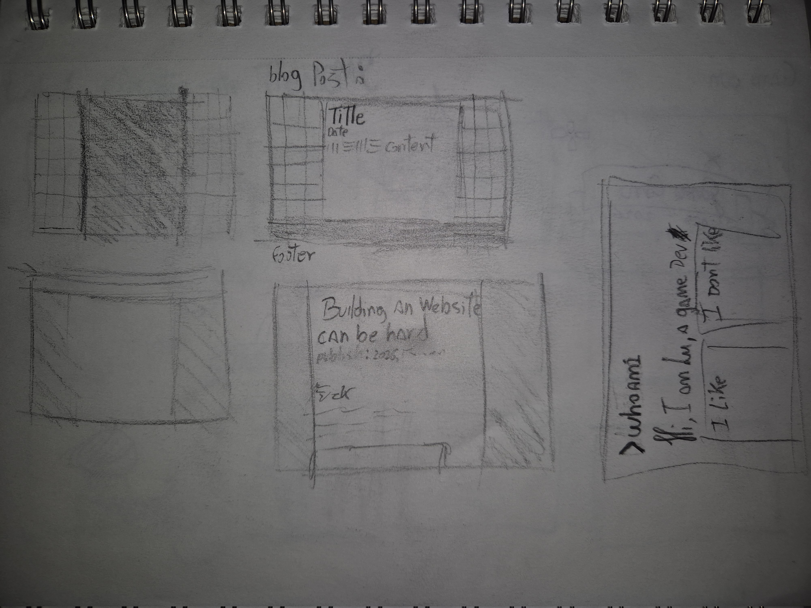
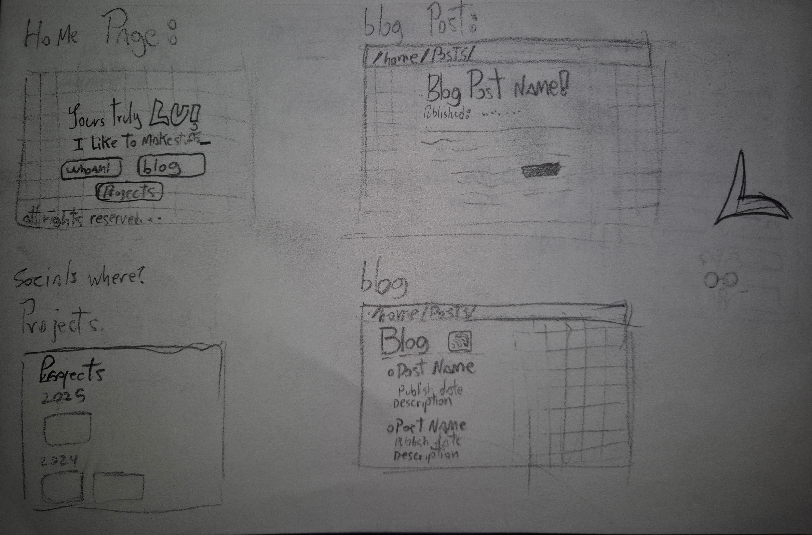
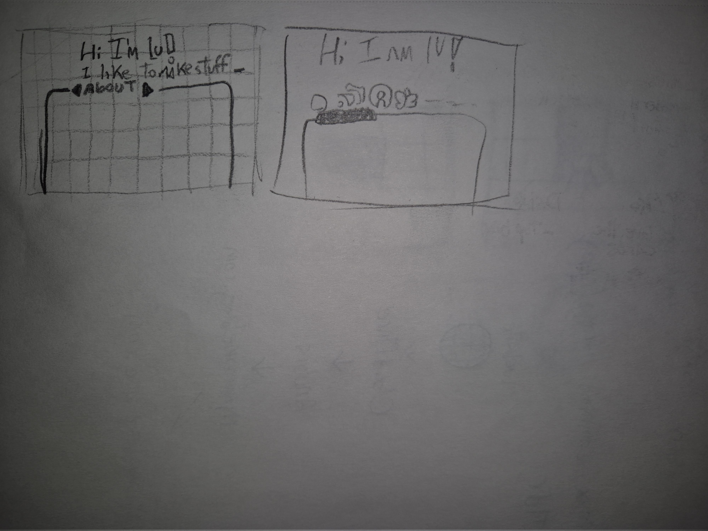

___

"And so she begins, to touch the computer…" - Halimede

I was always a big computer nerd and never really shy away from it, I was always amazed how people made things and how I could also do the same. Since a young age, I grew up learning how to use computers to code and make my own games, work on back-end and make simple applications. But I never, **never**, adventured myself on making front-end. It's not that doing artsy stuff scares me, I am a graphic designer by passion nonetheless, but having to "code" my front-end always made me take a step back and return to my traditional ways. BUT NOT TODAY! TODAY I WILL TELL YOU HOW I MADE MY WEBSITE!

## Act I: Why?

### **The short answer:**

- Because I wanted, lol.

### **The long answer:**

- I have always been fascinated by blogging and the idea of writing stories or showing projects I made with people. I unfortunately, from a young age, made the connection in my brain that writing and reading, weren't pleasurable things but chores that I should finish as soon as possible, and it has severely affected me on my adulthood. Now I am trying to use this so I can try to finally spark and re-make these connections on my brain.

## Act II: The inspiration

I have been with this idea for a while but only now, after around 3 years of going back and forth, I finally had the courage to start after I recently came across the Website of [Ari](https://adryd.com/), a pretty cool person that sparked my interest in blogging again. From there my brain was motivated with a writing comeback.

I started to go after other website to read and get inspirations, and along the way learned a lot of interesting stuff!

Some of the websites I ended up using as inspiration and guides when creating my stuff was:

- [Queer Computer Club](https://queercomputerclub.ca/)

- [Skip](https://skip.house/)

- [Maia Arson crimew](https://maia.crimew.gay/)

- [Lina](https://lina.sh/)

- [https://hl2.sh/](https://hl2.sh/)

- [Breq](https://breq.dev/)

## Act III : Time To create

I should start of by saying I am an indecisive person...

Because of it I have a lot of sketches for the basic pages:

This website went through 3 revisions and used several different layouts and I think in the end I am happy with the approaches I took it :D

Most of my design was done on paper and then later I was able to bring it into reality by using a framework called [Astro](https://astro.build/). I know it's a bit of a bazooka for a simple blog project, but I felt it would be nice to learn it and its intricacies so I can use it for more complex projects in the future. It offers a bunch of cool functions that really made my life doing this website much easier.

## Act IV: The Conclusion.

I am excited to finally start blogging on my website! I am really happy how it turned out, and I feel it represents me :D

I am excited to also be part of the small-net websites community, there are so many cool projects out there!

So if this inspired you, go out there and make something you are proud of! Be creative! Be nerdy!
