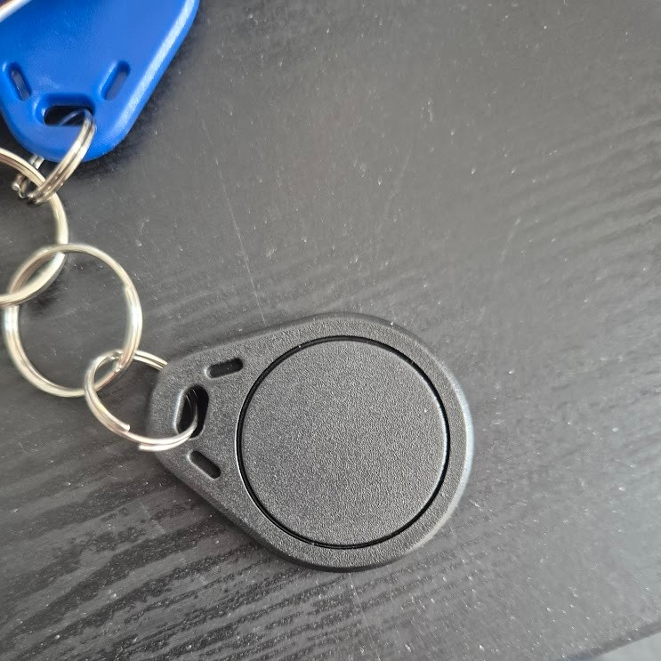
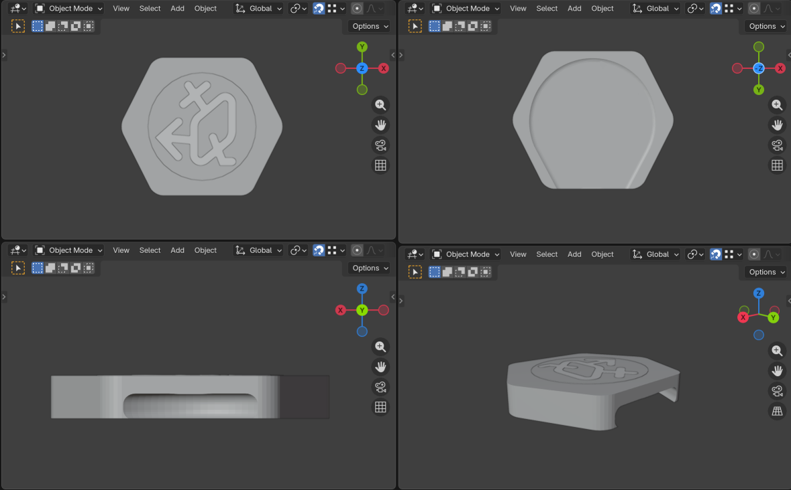
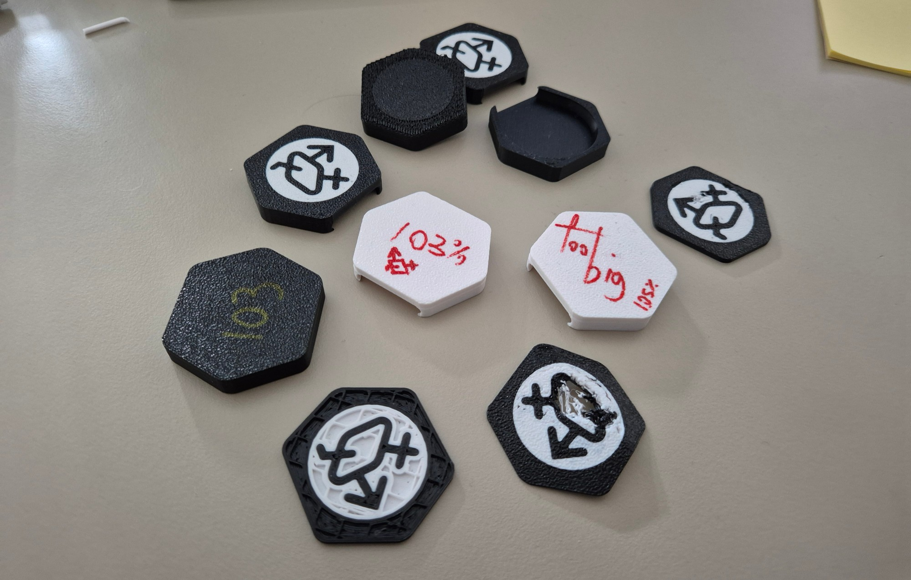
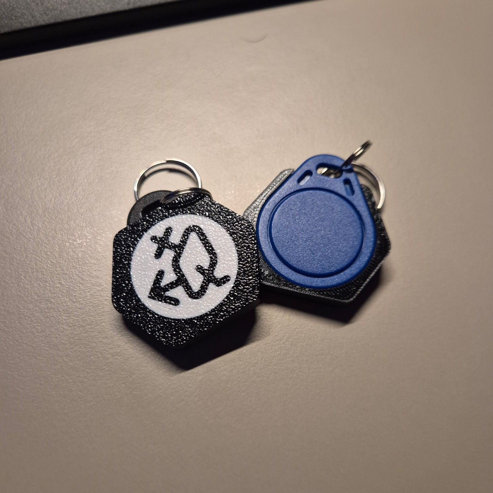

---

## Lu is officially a QCC Member!

I am so excited to be part of the [Queer Computer Club](https://queercomputerclub.ca/) here in Toronto! 

When I became a member I got keys to the space and they are simple NFC fobs. Their design is pretty simple and for some people thats great! *(some people don't want it to call attention)* However I like to customize my gear and make it look cool.

## So What did I do to my Keys?

I wanted to customize them, but since I didn't want to make permanent changes, stickers or glue were off the table. Then I had a genius idea: why not 3D print a custom case that I can just snap on? 

That’s when my silly brain started prototyping.

## Part 1: Making the Fob Case in Blender

Before doing anything I needed to get a rough estimate of the fob in Blender, so I just took a picture and started modeling it, I didn't grab measurements at the time and that came to **bite me later** on the process.

After that I started to design the case for it. I wanted something sleek and that wouldnt make the tag clunky while also being stylized. In the end my idea was simple, use a hexagon! Because the hexagon is the bestagon!

## Part 2: Making the Design

After getting the roughshape of it done I decided to go and stylelize it. I wanted it to be unique but also easy to print, so no complex design on the face. In the end there wasnt a lot of back and forth on the idea, I simply made so that the bottom has a circle area where i stuck the QCC logo on.

When it come to printing I did so that the design is split in 3 parts in one `.stl`, and it worked pretty well! I have heard that you can use a `.obj` for a better control of multi-color prints, but I havent really done any research on it so can't confirm how well it works.

## Part 3: Don't Measure, Re-Size It More Than Once

So it was time to print, and well, let's just say my "visual estimate" was a bit ambitious. It was way too big.

Remember how I didn't measure? After failing beautifully on the first attempt, I finally did the responsible thing: I grabbed the calipers and looked for an existing reference model online. Even then, it took a lot of attempts to find the sweet spot. 

> **Fun fact:** different filaments (and even colors!) can shrink or expand differently. I eventually found the perfect fit using **Black and White PETG From Elegoo**.

I choose PETG because its a more durable than PLA  and about the same price, so it felt like the good choice.

## Part 4: Print like crazy

Now that I got the model and sizes right there was only one thing left to do, print the final versions! In the end I decided to print 30 of them so enough people could grab one at the space but it also wouldnt be too crazy of a number to print.

## Project Last Remarks

This was a really cool small project to work on and I am really proud of myself for completing it. This project tought me to never understimate the hability of measuring stuff beforehand *(having to do re-do my modeling was not fun)*.
