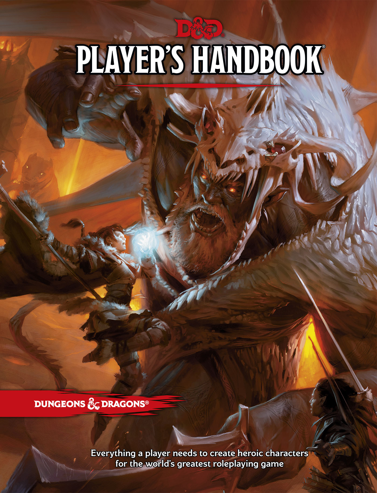
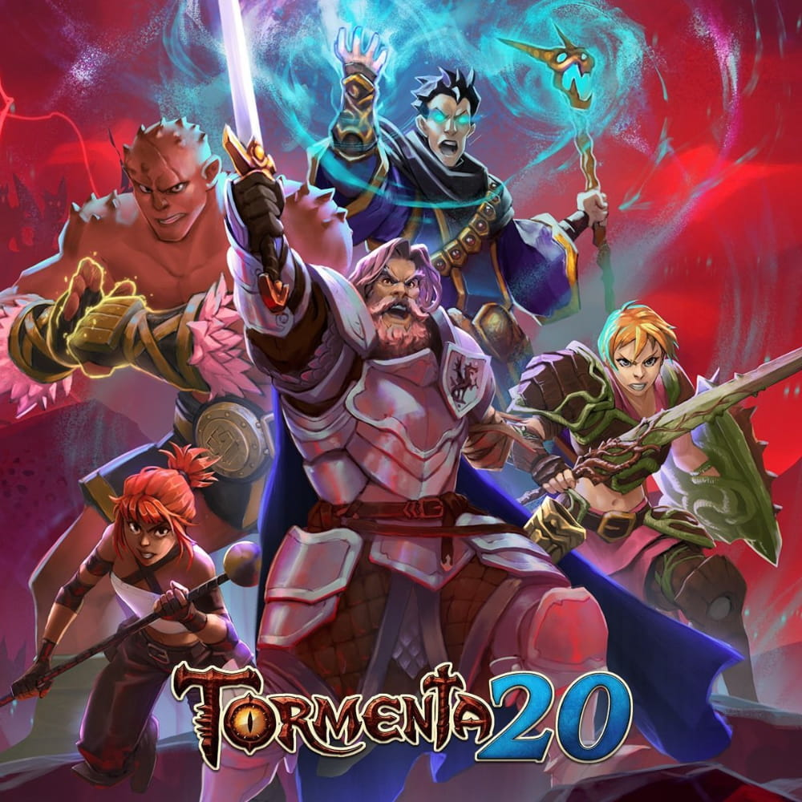
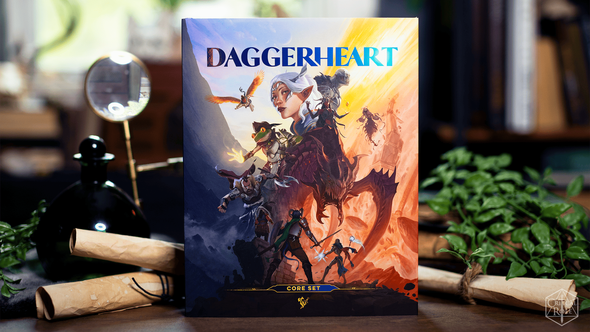
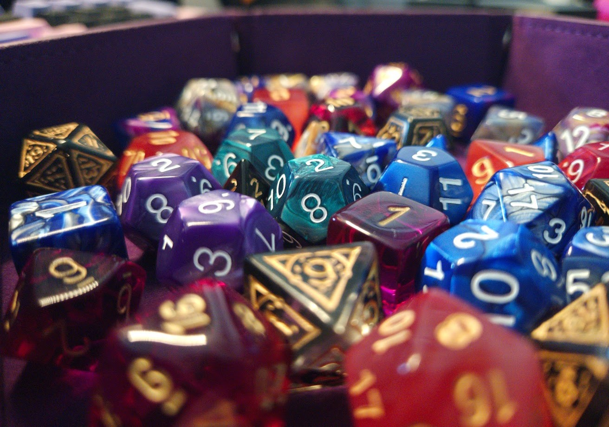

### A bit of context before info dumping
As you would tell a therapist:

"It all started in my childhood"

When I was a kid, I remember hearing my cousin talk about his D&D adventures and how fantastic they were. He was the GM of his group and, from time to time, he would show me the stories he had written, how he would plan the big fights, and all the puzzles that would appear—sometimes even using kids' puzzles for the sake of being funny. Since, at the time, I was too young, he said I would have to wait a year or two before playing at his table or having him run a campaign for me. I was too immature and respected that. When I was a bit older, I asked again. 

He did say he would do it and just needed to prepare it. Unfortunately, that time never came. I understand that he was busy, especially going into university and how chaotic that would be, but I wanted to play it and share this same passion with him. Since I still wanted to play the game, I did what I know best: said *f&%@ it* and got a version of the rulebook to learn (5e). I called some friends and asked if any of them wanted to play with me, and slowly I was forming a table.

## Dungeons & Dragons, the beginning

The first system I ever learned was the good old D&D! I imagine that is the first system a lot of people learn and usually stick with without really looking at other options. D&D had almost everything I could need to run my first campaign. The issue at the time was I didn't know it had expansions, and I wanted to create a magical steampunk world, but in the base book, there was nothing to guide me. Because of that, my first campaign was complicated...

My friends and I didn't really enjoy it—it was a mess, as simple as that.

With time, reading more about it, and finally learning about the expansions, I was able to run a less messy campaign. I did simplify it and made a more traditional story, but in the end, it was enjoyable and we were able to have nice memories of it.

### The magical system of D&D
Personally, I dislike it.

For me, the whole thing with *"Oh no, I am out of spell slots"* was always something that bummed me out when playing a magical character. When being a GM, I could use magic as I wanted and make my players have a hard time if I wanted to (never done that because I don't believe it would be fun), but the few times I played not as a GM, I was always running out of spells or stuff to do.

Because of this, I ended up homebrewing my own magical rule where the player could use as many spells as they wanted as long as they didn't roll below a threshold. I wanted magic to be used more, but also not an infinite amount.

The simple homebrew was:

---
#### MAGICAL RULES
1. The player is allowed to use their spell as long as they don't fail a "use magic" roll.
2. If the player fails this roll, the spell still happens, but at half effect, and that spell goes on cooldown.
3. If the player rolls a 1, the spell fails immediately and starts its cooldown.
4. If the player uses a spell more than 5 times during a session, make the threshold bigger or put it on cooldown for the next session.

The fourth rule was in place so players wouldn't spam only one spell and to make them think about how to use their other spells.

--- 

## A pause on TTRPGs
I won't say I completely stopped playing or reading about them. I learned other systems like Call of Cthulhu and Pathfinder, but with the end of high school and the start of looking for a Uni to apply to, I didn't have the time to play any campaigns or be a GM for any of my friends. Also, groups change and friendships come and go. 

One system I learned during that time but was never able to pick up was Tormenta 20 (a Brazilian TTRPG system). It was recommended by one of my friends and seemed interesting, but having to translate it so that I could play with friends was going to take too much time that I didn't have on my hands.

Now in university, I have time to play TTRPGs again! I was able to play a campaign that lasted only 5 sessions—not as DM, so I was able to focus on making a character I liked. Now I want to be a Game Master again, but I really don't want to use D&D. Not because it's bad or because of any of its controversies, but because I want to try something new, something fresher. Something that's indie and has space to create a fanbase! That's where Daggerheart comes in.

## Daggerheart, the new kid on the block

Daggerheart is a new tabletop RPG developed by the people at [Darrington Press](https://darringtonpress.com/), and I fell in love with it, with some caveats. I love the fresher look it brings to the table, and I really like some of the mechanics, systems, and tools it offers the GM and their party. 

One example would be the Duality dice, a mechanic where you use 2d12 to roll your successes and failures. Depending on how they roll, you get different outcomes and a kind of currency (Hope and Fear). Every time they roll with Fear, the GM gets a Fear point that can be used later to make something bad happen. And every time they roll with Hope, the player gets a Hope point, letting them spend it to make brave or extraordinary feats inside the game.

Other stuff that makes me love the system is how inclusive it is and how they have amazing tools to help the GM create their campaigns—from the idea of touchstones (references that help the players and the GM ground themselves in the world) to campaign frames.

The one thing I am not a big fan of right now is the card system. Personally, I dislike the idea of having to carry them and keep track of them, but since I haven't run a campaign with this system yet, I can't say for sure how it will play out.

## Dice goblin
I am also a dice goblin, meaning I have too many dice and will get more in the future. You might ask me why, and the answer is simple: I like collecting shiny trinkets, and having different dice styles is pretty cool! I normally carry 2 sets with me when playing, but depending on the character, I might want to have a specific set to match them, so that's why there are so many.

## Closing statement
Get out there, learn new things, and play TTRPGs with your friends! I highly recommend it!