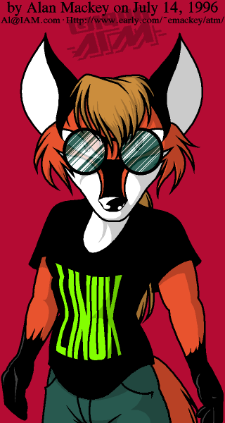
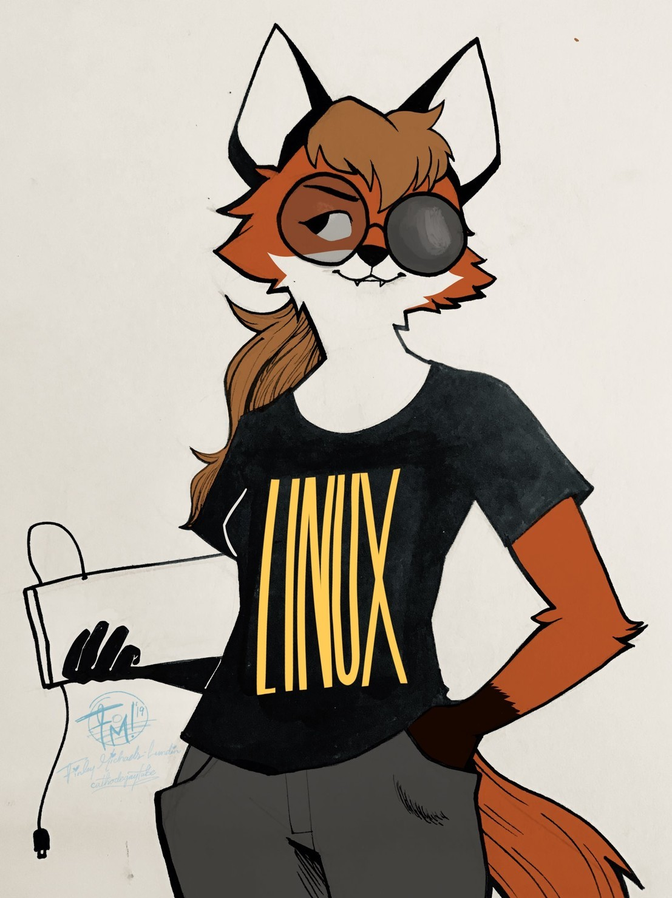
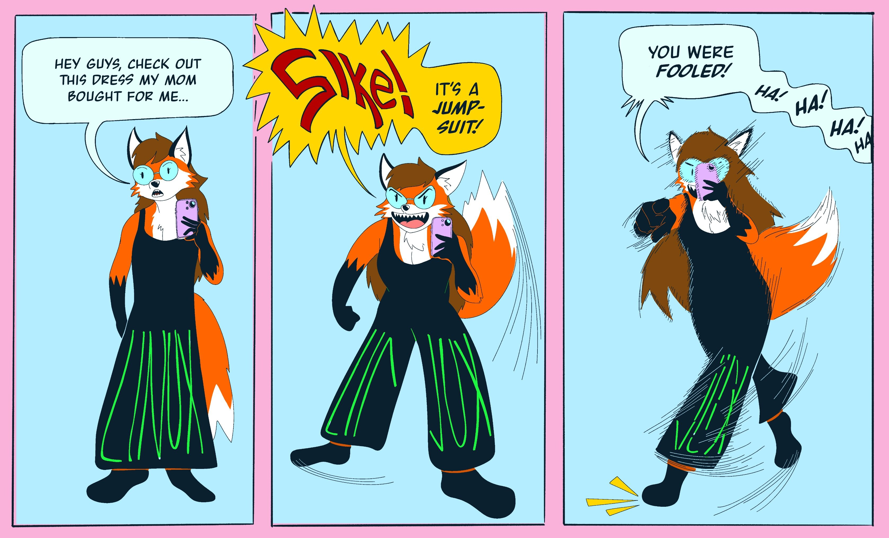
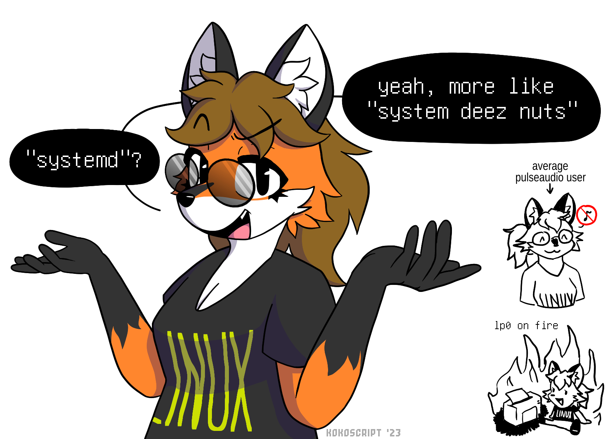

---

So, before entering the rabbit hole that this might become let me first introduce her.

## Who is Xenia?

Xenia was a mascot concept for linux back in 1996 created by Alan Mackey. She was supposed to be an alternative to the good old Tux.  

(design by Alan)

One curious thing of Xenia is that she was originally a male character but after a re-design made by [cathodegaytube](https://www.tumblr.com/cath0degaytube/), and a supportive email by Alan Mackey himself, She transition to female and got the name of Xenia! Making her a small trans icon on the linux community.

*One cool fact I learned is that some of Alan's friends that used linux ended up transitioning so it made sense to him for Xenia to become a girl*

## How I ended up falling in love with the character?

So about 5 years ago [Linux Lounge](https://www.youtube.com/@linuxlounge) made a [video](https://www.youtube.com/watch?v=0b4eW1KAuWE) on the topic and I ended up finding it in my Youtube recommendations, the video just quickly explaines how that happen and how supportive the linux community was with the characters transition. I kinda felt in love with the character for several reasons: 

1) I used to wear a pair of glasses exactly like hers

2) I am a big nerd and fan of linux

3) I am a someone who doesnt quite identifty with my gender assigned at birth.

4) Foxes are neat

I love that Xenia’s `sudo update && upgrade` included a gender transition. As someone who also doesn't quite fit the default settings I was born with, and hope to transition, seeing her go from a  concept to a modern trans icon is just so **cool**!

Because of all of these reasons,and more, Xenia became my pfp on several places and I am always joyous of new art of her.

She is easily on my top 5 confort characters. While there is no story or adventure Xenia participates for me to follow, I always love to see where the community of artist would put her or do with her, I specially love the memes:

Art by: [Reality Trends](https://vt.social/@realty_trends/111832464054450194)

Art by: [Koko](https://yiff.life/@koko/111618932283595363)

Art by: [kadabliuh 2009](https://www.furaffinity.net/view/46685395/)

### So Yeah....

Xenia my beloved <3
