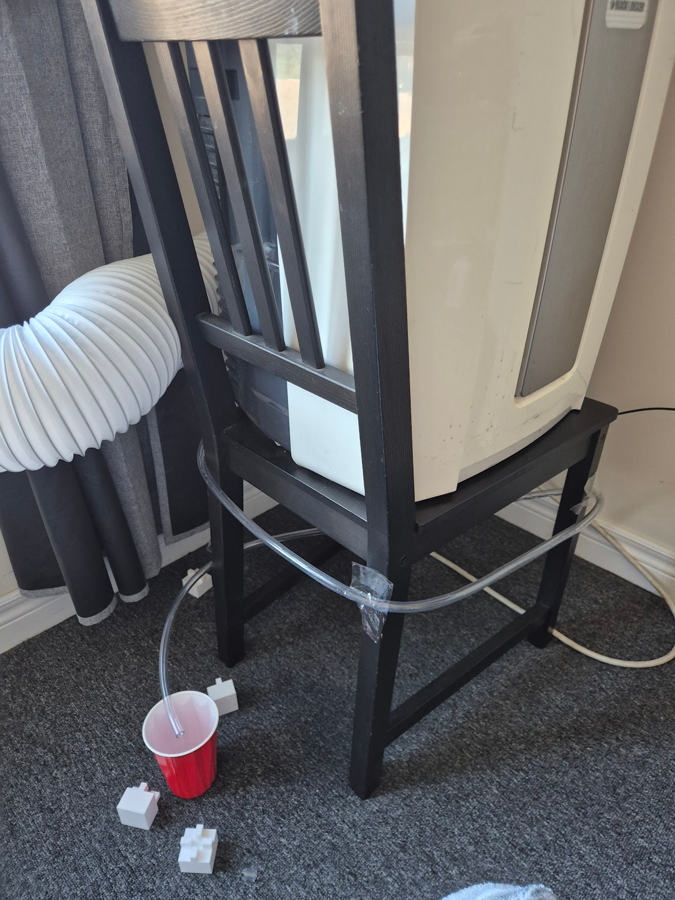

---

# Guess who finally got a bike

Since I got my own place I haven't had the change to get a bike or bike in general. I grew up biking around my city and using it as my main method of transportation, unfortunately a bike is something big that I couldn't easily bring with me.

Now that I got a job I was able to finally get save up some money and buy myself a bike to ride during the summer. I cannot even begin to describe how much I missed this feeling, being able to just take it anywhere and get some exercise out of it is great! I always feel happier after biking for a while, the only downside is that since I haven't bike in a while my legs a freaking sore, so need to get used to it again lol.

# Projects, Projects, Projects. Where are they?

> they ain't here bud lol

Unfortunately, since I got a job I haven't had much time to do much and a lot of my recent projects require time, and personally I have no energy to work on them when I get home. I want to at least finish one of my projects this month. 

## On a side note

I finally got back into reading! I haven't read a book in a while **(around 4-5 months)** and its nice to finally pick up something to read that is not an engine documentation or a weird plug-in I want to work with.

I am about to finish an amazing trilogy called [Scythe](https://en.wikipedia.org/wiki/Scythe_(novel)), written by Neal Shusterman, its such a amazing trilogy with interesting characters and with a really well done world building in my opinion :D

I wont get into too much detail because I want to write a lengthy post about it and because I don't want to give spoilers.

I highly recommend the read :D

# THIS AC IS GOING TO GIVE ME AN ANEURYSM

Guess who just gave a new problem. Yes, my AC.
I wake up one day thinking my it is finally working with no issue, but wait, why is the floor wet? 

***The AC was leaking*** 😭

Until this point the AC had not produced a single drop of water but, from what I think, since it got really humid recently it just finally produced enough water to need to expel it. It took **3 full days** for my floor to finally get dry, and while I waited for it I went after a way to prevent this from happening in the future.

First I tried 3D printing, however, because my floor is carpet, the prints would not work and fall with the AC vibration. I had to think of plan B, how could I solve my problem without having to buy more pieces for it or even going after the original pieces? My solution was to buy a hose and prop the ac off the floor. Its pretty sketchy, now it is on a chair and the hose, goes to a bottle ( in this case its goes to a red solo cup that I was testing).
I guess i deserve an honorary engineering badge after this one lol

*Please AC, please don't give me more issues*