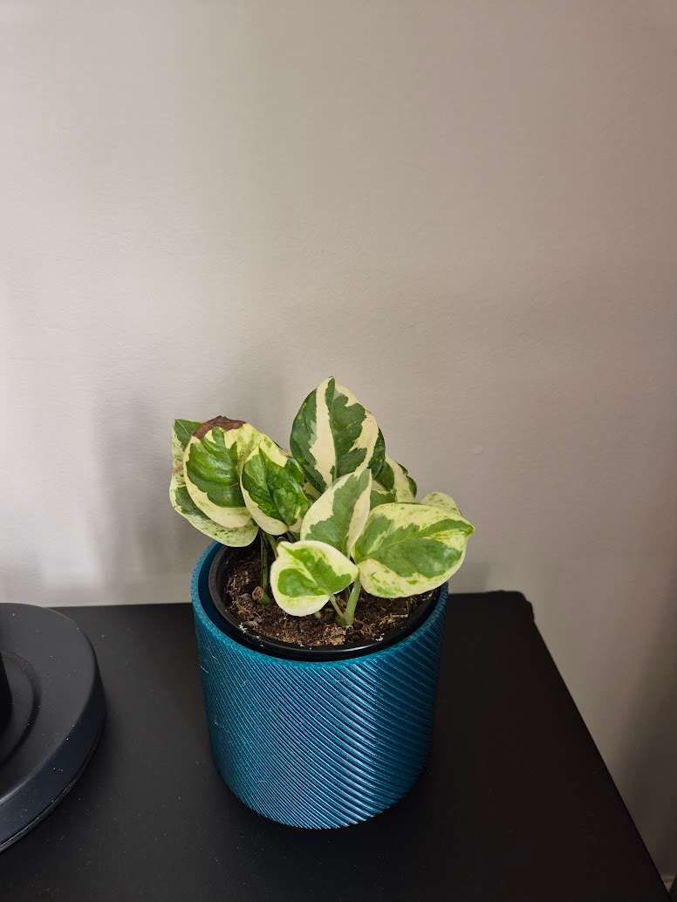
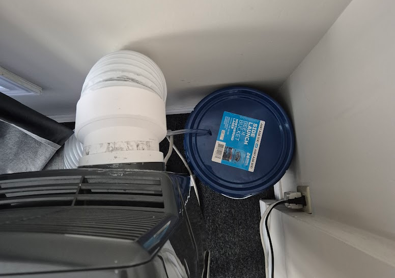

---
# I started taking care of a plant

Since I got my own space, I felt something was missing. I wanted something alive (apart from me)  that I needed to take care of. So this is where Spot (my plant!) comes in. Spot is a simple Pothos plant that I bought, and they have really brighten up my space. At the very least, having them around makes my environment nicer.

Spot originally came in a simple plastic cup, but knowing myself, I wanted to make something custom. Because of this, I went ahead and 3D Printed a vase for it using a really cute green PETG I had on hand.

# Pride!
Going to Pride was such a great experience! It was a bit too hot outside, but still incredibly enjoyable since I went with friends. I saw so many amazing artists, Drag Queens and Kings, and people just showing their pride and supporting each other. It was 100% a wonderful time!

# Do I really have to say.... The AC is back 🤪

This time, it's more of an update than a complaint!

I actually really happy with how it is working! In fact, it's working so well that I had to change my old method of collecting water for a *Freaking* 20-liter (5-gallon) bucket! it looks so unnecessary, but at least I only have to take the water out once a week, so ^-^

# Why no weeklys recently?
To be honest, I've been incredibly busy with work, a personal game project, and writing two new pieces: a new Ramble and the first chapter of a story I want to start publishing. Both are taking up a lot of time because I'm doing research on the side and reviewing my drafts from time to time. I promise that, hopefully by the end of the month, I'll have both published so you, my dear reader, can finally check them out.

I will be posting a prologue to the story I'm writing very soon, and I'm hoping it sparks your curiosity! :D